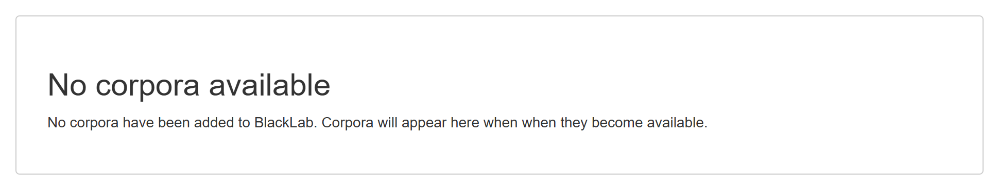
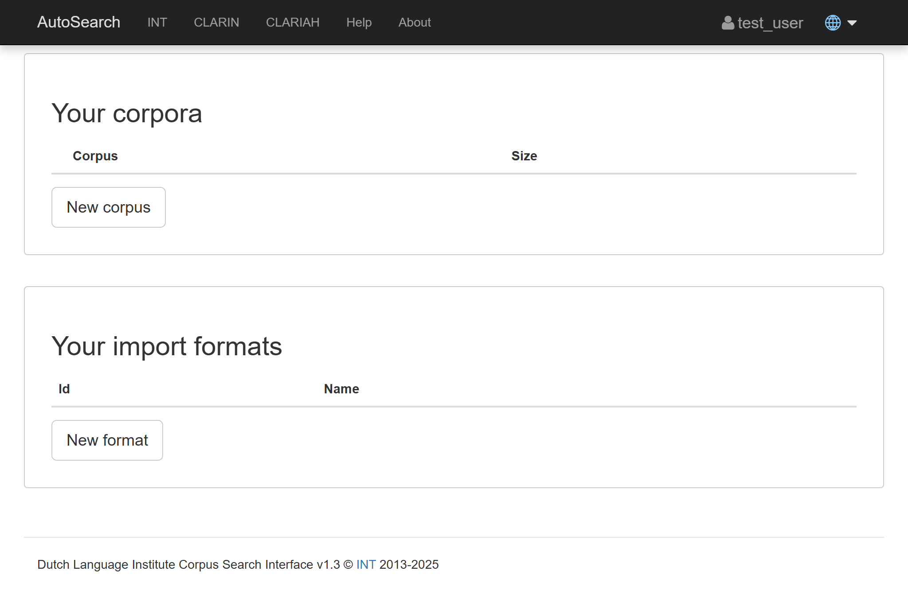

# Installation using Docker

## Basic Setup

Here is an example `docker-compose.yml` file for a barebones installation of BlackLab and Corpus Frontend.

1. **Create the `docker-compose.yml` file**
   - Place the following example in a directory of your choice.
   - Replace the placeholder paths (`/path/to/...`) with the actual paths on your system.  
    
   ::: details Example `docker-compose.yml`
      ```yaml
      services:
        frontend:
          image: instituutnederlandsetaal/blacklab-frontend:dev
          ports:
            - 8080:8080
          volumes:
            - /path/to/your/corpora:/data/index
            - /path/to/your/user-corpora:/data/user-index
            - /path/to/your/corpora-customizations:/etc/blacklab/projectconfigs
            # Optionally, to override the default configurations
            # See the docs for more details on these files:
            # - /path/to/your/corpus-frontend.properties:/etc/blacklab/corpus-frontend.properties
            # - /path/to/your/blacklab-server.yaml:/etc/blacklab/blacklab-server.yaml
          environment:
            - JAVA_OPTS=-Xmx4g
      ```
   :::

2. **Run Docker Compose**  
   This will start the service
   ```bash
   docker-compose up -d
   ```

3. **Access the Application**
   - The Corpus-Frontend is now available at http://localhost:8080/corpus-frontend/
   - The BlackLab-Server API is now available at http://localhost:8080/blacklab-server/

4. **You should now see an empty page with a message saying "No corpora available".**
   
   This is expected, as you have not yet added any corpora to the system.  
   At this point you can either:
   - Read on to learn how to enable uploads in the Corpus Frontend.
   - Or [add a corpus](../tutorials/add_a_corpus.md)

## Basic setup with uploads enabled

The following section explains how to enable a **test user** in BlackLab, so you can play around with the process of uploading data through the UI.

::: info :information_source: **BlackLab does not support user registration and login natively.**  

BlackLab relies on external softare such as proxies to implement user authentication, using a forwarded header (typically `remote-user`) to know who you are.  
The Corpus Frontend in turn relies on BlackLab, so you should only need to configure BlackLab (and your proxy).

:bust_in_silhouette:  [This tutorial](../tutorials/social_logins.md) details how to set up a proxy that can integrate with Microsoft, Google, Facebook, etc.  
For a more technical explanation, consult [the BlackLab docs](https://blacklab.ivdnt.org/server/howtos.html#let-users-manage-their-own-corpora).

:::

1. **Create the `blacklab-server.yaml` file**   
   ::: details Example `blacklab-server.yaml` with a test user enabled
      ```yaml{4-7}
      ---
      # https://blacklab.ivdnt.org/server/configuration.html
      configVersion: 2
      authentication:
         system: 
            class: AuthDebugFixed
            userId: test_user
      indexLocations:
      - /data/index
      userIndexes: /data/user-index
      ```
   :::

2. **Edit the `docker-compose.yml`**  
   Uncomment and set the line that mounts the `blacklab-server.yaml` file in the `docker-compose.yml` file. No `.env` file is needed.
   ::: details `docker-compose.yml` with the config mounted
      ```yaml
      services:
        frontend:
          image: instituutnederlandsetaal/blacklab-frontend:dev
          ports:
            - 8080:8080
          volumes:
            - /path/to/your/corpora:/data/index
            - /path/to/your/user-corpora:/data/user-index
            - /path/to/your/corpora-customizations:/etc/blacklab/projectconfigs
            # Optionally, to override the default configurations
            # See the docs for more details on these files:
            # - /path/to/your/corpus-frontend.properties:/etc/blacklab/corpus-frontend.properties
            - /path/to/your/blacklab-server.yaml:/etc/blacklab/blacklab-server.yaml    # [!code focus] [!code highlight]
          environment:
            - JAVA_OPTS=-Xmx4g
      ```
   :::

3. **Restart the Docker container**
   ```bash
   docker-compose up -d 
   ```

4. **You should now be presented with options for uploading data.**
   