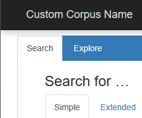

--- 
title: Corpus Name
---

# Customize the corpus name

By default the name of your corpus is set when it is first created, but optionally you can override it using the `search.xml` file. The corpus name is used in the title of the page and in the navbar. 



```xml
<SearchInterface>
    <InterfaceProperties>
		<DisplayName>Custom Corpus Name</DisplayName>
	</InterfaceProperties>
</SearchInterface>
```

## Using JS

Setting the corpus display name using Javascript is currently not possible.
Technically, you could replace the displayName in the BlackLab corpus instance, but this is not recommended.