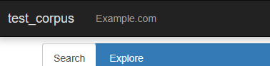

# Navbar Links

You can customize the links in the navbar of the Corpus Frontend by adding a `<NavLinks>` element to the `search.xml` file. This allows you to add links to external resources or other pages within your corpus.



::: warning
Attributes other than `value` and `newWindow` are ignored at this time.
In the somewhat near future, this feature will be updated to allow all attributes of the regular `<a>` tag, such as `class`, `id`, etc.
:::

```xml
<SearchInterface>
  <InterfaceProperties>
    <NavLinks>
      <Link value="http://www.example.com/" newWindow="true">Example.com</Link>
    </NavLinks>
  </InterfaceProperties>
</SearchInterface>
```

