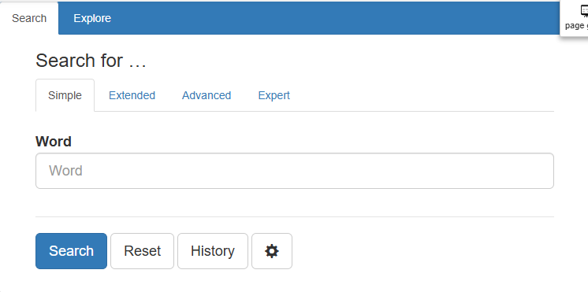

# Simple Search



<!-- @include: ../_custom_js_tip.md -->


## Changing the searched field

By default the Simple Search searches the `main annotation` of the corpus.


To change the searched field:

```js [usage]
vuexModules.ui.actions.search.simple.searchAnnotationId('lemma');
```

::: info Main Annotation
The `main annotation` is the **first** annotation in BlackLab. Usually that will be `word` (or an analog).
It is the **topmost** entry in the `annotations` section of the topmost entry of the `annotatedFields` section in the `.blf.yaml` file.
See [BlackLab's docs](https://blacklab.ivdnt.org/guide/index-your-data/simple-example.html).
:::
