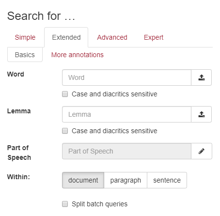

# Extended Search

Extended search lets you search multiple fields at once.
By default every `annotation` in your corpus is shown here, but you can limit or organize the selection as you see fit.

<!-- @include: ../_custom_js_tip.md -->

## Group annotations in tabs



Grouping Annotations can currently only be done through BlackLab, by using the `annotationGroups` setting in the `.blf.yaml` configuration.

See the [BlackLab docs](https://blacklab.ivdnt.org/guide/how-to-configure-indexing.html#full-example-of-a-configuration-file) for more info on that.

Here is a simple snippet illustrating the config for the example image.
The ids here are just an example, in reality they depend entirely on your own configuration!

```yaml
# my-corpus-format.blf.yaml
corpusConfig:
  annotationGroups:
    contents:
      - name: Basics
        annotations:
          - word
          - lemma
          - pos
      - name: More annotations
        annotations:
          - example
        # etc...
```

::: tip
If you've defined groups, any leftover annotations are put in a "remainder" group, which is hidden by default!
:::

## Order of annotations

The order of fields on the page is taken from the [annotationGroups](https://blacklab.ivdnt.org/guide/how-to-configure-indexing.html#full-example-of-a-configuration-file) in the BlackLab `.blf.yaml` used to create the corpus, falling back to order of declaration for fields not inside a group.

It's not currently possible to change the display order of these fields using the JS API.

## Show or Hide annotations

<!-- @include: ../_table_based_layout_tip.md -->

Alternatively, these are the dedicated functions:

::: code-group

```js [usage]
vuexModules.ui.actions.search.extended.searchAnnotationIds(['word', 'lemma']);
```

```ts [definition]
function searchAnnotationIds(ids: string[]): void;
```

:::

<!-- @include: ./_within.md -->
