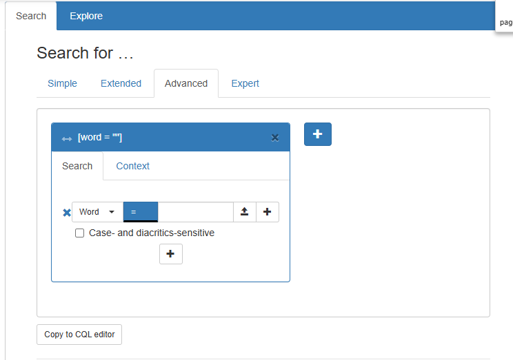

# Advanced Search (Querybuilder)




## Hide the Advanced Search

```js
vuexModules.ui.actions.search.advanced.enable(false)
```

<!-- @include: ./_within.md -->

## Show or Hide annotations

<!-- @include: ../_table_based_layout_tip.md -->

```js [usage]
vuexModules.ui.actions.search.advanced.searchAnnotationIds(['word', 'lemma']); 
```

## Default annotation

You can change the default selected annotation:

```js [usage]
vuexModules.ui.actions.search.advanced.defaultSearchAnnotationId('word');
```

