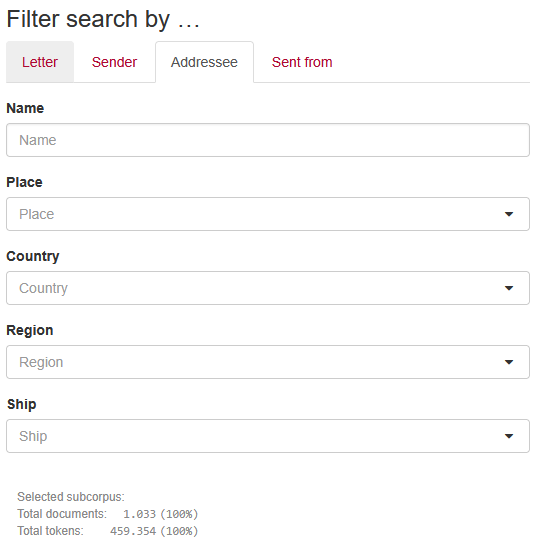

# Filters


 
In `Extended`, `Advanced` and `Expert` search, Filters are shown.
These represent Document Metadata, e.g. year of writing, title, author, etc. (depending on how you indexed your data).
In BlackLab terms, these are `metadata` fields, see [the docs](https://blacklab.ivdnt.org/guide/how-to-configure-indexing.html#document-metadata).


## Organize filters in tabs

In the example image above, filters are grouped into different categories by using tabs.
This is best done through BlackLab, by using the `metadataFieldGroups` setting in the `.blf.yaml` configuration.  
See the [BlackLab docs](https://blacklab.ivdnt.org/guide/how-to-configure-indexing.html#full-example-of-a-configuration-file) for more info on that.

::: info
The current situation is not very user-friendly, we'll work on improving this workflow in the future.
:::

### Example 
Here is a simple snippet illustrating the config for the example image.
The ids here are just an example, they should match the Metadata Fields in your corpus.

```yaml [.blf.yaml]
# .blf.yaml
corpusConfig: 
  metadataFieldGroups:
  - name: Letter
    # fields: ...
  - name: Sender
    # fields: ...
  - name: Addressee
    - adr_naam_norm
    - adr_loc_plaats_norm
    - adr_loc_land_norm
    - adr_loc_regio_norm
    - adr_loc_schip_norm
  - name: Sent from
    # fields: ...
```

::: tip :warning: Leftover fields are hidden!
If you've defined groups, any leftover metadata is put in a "remainder" group, which is **hidden**!  
This means the field won't show up in the interface any longer! This includes at least the following locations in the search form and results:
  - `Explore/Corpora`
  - `Filter`
  - `Per Hit/Group by`
  - `Per Hit/Sort by`
  - `Per Document/Group by`
  - `Per Document/Sort by`
:::

## Order of Filters

The order of filters on the page is taken from the [metadataFieldGroups](https://blacklab.ivdnt.org/guide/how-to-configure-indexing.html#corpus-metadata), falling back to order of declaration for fields not inside a group.

## Show or Hide Filters

<!-- @include: ../_table_based_layout_tip.md -->

::: code-group
```js [method 1]
// Show only these metadata fields in the filters section
vuexModules.ui.actions.search.shared.searchMetadataIds(['title', 'date']); 
```
```js [method 2]
frontend.customize(corpus => {
  /** @param {string} filterId
   * @returns {boolean | null} true/false to show/hide, null to use default behavior.
   */
  corpus.search.metadata.showField(filterId => {
    if (filterId === 'title') return true; // show title filter
    return null;
  })
})
```
:::

## Span filters

Adding span filters (to filter by part of documents)

To add an extra tab where you can filter by part of the document, such as only searching in certain types of named entity, or speech by one person:

::: code-group

```ts [definition]
function addCustomTab(
  /** (display-)name of the tab, can be overridden using locale files/internationalization. */
  name: string, 
  fields: FilterDefinition[]
): void;

function createSpanFilter(
  /** Span Name, e.g. 'named-entity' */
  spanName: string, 
  /** Attribute name, e.g. 'type' */
  attrName: string, 
  /** Widget to use. 'auto' is the default and will choose between `text` and `select` based on the number of unique values. */
  widget: 'auto'|'text'|'select'|'range' = 'auto', 
  /** Display name of the filter (optional). Can be overridden using locale files/internationalization. */
  displayName: string, 
  /** Metadata object (optional). You can override the options for a select widget here (default are all the actual values in the corpus). */
  metadata: any = {}
): FilterDefinition;
```
```js [usage]
frontend.customize((corpus) => {
  const m = corpus.search.metadata;
  m.addCustomTab(
    'Span filters',
    [
      m.createSpanFilter('named-entity', 'type'),
      m.createSpanFilter('speech', 'person'),
    ]
  );
});
```

:::
