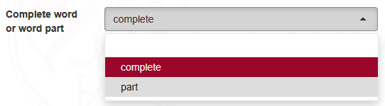
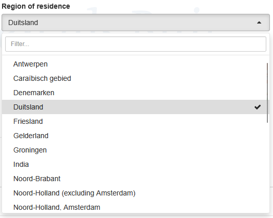
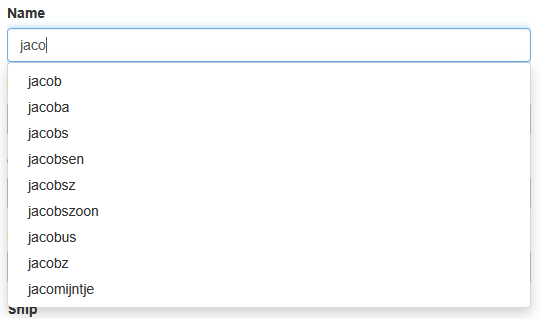

# Change the type of input fields

The search form contains many input fields for Filters/Metadata and Annotations, and you can customize what widget is shown for each field.

## Overview

Widget types can be set for:
- **Metadata fields** (filters)
- **Annotation fields** (token-level attributes)

Most widgest can easily be configured in the `.blf.yaml` file, but some widgets require a bit more work, as they need some extra data not available in the `.blf.yaml` file.

## Annotations

Widgets for Annotations can be configured in two ways:
- By setting the `uiType` of an annotation in the `.blf.yaml` 
- Through the JS customization API.

::: code-group

```yaml [.blf.yaml]
# NOTE: uiType in the `.blf.yaml` cannot be changed after creating the corpus.
# Changing it later requires manual editing of the index metadata (not recommended), 
# or recreating of the index/corpus.
metadata: 
  fields: 
  - name: author
    uiType: select
  - name: year
    uiType: range
```

```ts [custom.search.js]
function customizeUIType(
  annotatedField: NormalizedAnnotatedField, 
  annotation: NormalizedAnnotation
) {
  // For example:
  switch (annotation.id) {
    case 'author': return 'select';
    case 'year': return 'range';
    default: return null; // use default
  }
}

frontend.customize(corpus => {
  // The function you set will be called for every shown annotation:
  corpus.search.pattern.uiType = customizeUIType;
})

```
:::

### Annotation Widgets

The following widgets are available for Annotations,
use the name of the tab as the `uiType` in the `.blf.yaml` file, or return it from the `customizeUIType` function.

::::: tabs

== select / dropdown
  ### Select _(Dropdown)_
  `Select` is the default when an Annotation doesn't have very many values. Currently this is up to `500` values.  
  Unlike the Metadata `select`, this allows only a single selection.

  

  ::: warning 
  When there are too many options we no longer load them all, and we automatically convert the widget back to `autocomplete`, so users don't inadvertently miss any options.
  :::


== autocomplete / combobox
  ### Autocomplete _(Combobox)_

  `Autocomplete` is the default when when there are more than `500` values, or when the values are not known beforehand for another reason. This is usually the case for word and lemma field (depending on your data).

  


== pos
  ### POS _(Part of Speech)_

  :warning: _Not supported in the Simple Search_  
  This is an extension we use for corpora with split Part-of-Speech tags.
  It lets users select from the set of available tags, filtering out the ones that are not relevant. 

  ::: tabs
  === closed
  
  === opened
  
  :::

  You will need to write a json file containing a `tagset` definition, that contains the list of available tags, which which subtags are available for each tag.
  In addition to setting uiType `pos` for the main tag, you will also need to instruct the frontend to load the tagset file.

  ::: tip Tagset generator
  There is an experimental page in the interface that lets you create a tagset file. It is not yet available in the interface, but you can access it by going to `/corpus-frontend/${corpus_id}/configwizard/`. From there, select the Annotation that holds the main Part of Speech tag, and the annotation(s) that hold the subtag(s), the generator will query blacklab for all valid combinations, and generate a tagset file for you.
  :::

  ::: info 
  The tagset loading code has to run before `$(document).ready` fires! The reason for this is that the tagset needs to be loaded before we can decode the page URL (we need to know which part of the query belongs in the PoS editor), which is done when on first render.
  :::

  ::: code-group
  <<< @/../../src/frontend/src/types/apptypes.ts#docslinktagset [Tagset Schema]
  <<< ./_tagset_example.json [Tagset Example JSON]
  ```js [Loading the tagset -- search.js]
  vuexModules.tagset.actions.load(`${CONTEXT_URL}/my-corpus/static/path/to/my/tagset.json');
  ```
  :::


== lexicon
  ### Lexicon _(Autocomplete for Historical Dutch)_
  An extension we have developed for our own use. It aims to help users with searching in historical Dutch texts.  
  Whenever a word is entered, after a while, historical variants/spellings for that word are retrieved from our lexicon service. Those variants are then filtered against the corpus to see which actually occur. The user can then select if and with which of those variants he/she wishes to search.

  
  ::: tabs
  === Suggestions
  
  === Selected suggestions
  
  :::


== text
  ### Text
  `Text` is the fallback widget type. It is not recommended to use this for most cases, as it does not provide any autocomplete or dropdown functionality. 

  

::::: 
<!-- end annotation widget tabs -->


## Metadata _(Filters)_

Widgets for Metadata can be configured in two ways:
- By setting the `uiType` of a metadata field in the `.blf.yaml`
- By manually creating the filter with a different type with the JS API.

::: code-group

```yaml [.blf.yaml]{4,6}
metadata: 
  fields: 
  - name: genre
    uiType: checkbox
  - name: date
    uiType: date
```

```ts [custom.search.js]{3}
vuexModules.filters.actions.registerFilter({filter: {
  id: 'genre', // must match the metadata field name, except where otherwise stated
  componentName: 'filter-checkbox', // 'filter-' followed by the widget type

  displayName: 'Genre',
  description: 'Genre of the text',

  metadata: {} // extra info required for the widget. Differs per filter type, see below.
}});
```
:::


::::: tabs
== select / dropdown
  ### Select _(Dropdown)_

  `Select` is the default when a Metadata field doesn't have very many values. Currently this is up to `200` values.  
  Unlike the Annotation `select`, this allows for multiple selection.

  

  ::: warning 
  When there are more options we automatically convert the widget back to `autocomplete`, so users don't inadvertently miss any options.


== autocomplete / combobox
  ### Autocomplete _(Combobox)_

  `Autocomplete` is the default when when there are more than `200` values.

  

== checkbox
  ### Checkbox 
  
  Checkbox functions identically to the `select` widget, but instead of a dropdown, it shows a list of checkboxes. This is useful when you want to show all options at once.

  

  ::: warning 
  When there are too many options we no longer load them all, and we automatically convert the widget back to `autocomplete`, so users don't inadvertently miss any options.
  :::

== radio
  ### Radio 

  `Radio` allows only a single value to be selected, unlike `checkbox`

  

== range
  ### Range (single field)
  Use two inputs to specify a range of values (usually for numeric fields, but works for text too).

  

== range-multiple-fields
  ### Range (multiple fields)
  This is a special purpose field that can be used if your documents contain metadata describing a value in a range.

  ::: warning
  If your field is a date, it's usually better to use the `date` widget instead.
  :::

  

  ::: tip An example
  Imagine your documents have an unknown date of writing, but you roughly know the range, for example between 1900-1950. You store this data in two fields:
  - `date_lower` (1900)
  - `date_upper` (1950)
  Now, there isn't a single with the date, but two fields that together describe a range. This is where this widget comes in. It will show a min and max input box, but the actual query will be done against the two fields `date_lower` and `date_upper`.
  
  :::

  ::: code-group
  ```ts [Signature]
  function registerFilter(params: { 
    filter: {
      componentName: 'filter-range-multiple-fields',
      /** internal bookkeeping. MUST BE UNIQUE FROM ACTUAL METADATA FIELDS IDS */
      id: string,
      /** Display name to show if there is no localized display name */
      defaultDisplayName: string;
      /** Description to show if there is no localized description */
      defaultDescription?: string;
      /** The filter tab under which this should be placed, missing tabs will be created. Optional, only when using the tabbed layout. */
      groupId?: string,
      /** The settings for this filter */
      metadata: {
        /** the id of the metadata field containing the lower bound */
        low: string, 
        /** the id of the metadata field containing the upper bound */
        high: string, // 
        /** 
         * strictness mode: 
        * - 'strict': only match documents that fall fully within the range
        * - 'permissive': match documents that merely overlap with the provided range
        * - null: allows the user to switch between 'strict' and 'permisssive' 
        */
        mode?: 'strict' | 'permissive' | null, 
      }
    },
    /** The id of another filter to append this filter behind. Undefined will add the filter at the top. */
    precedingFilterId?: string;
  }): void;
  ```
  ```js{3} [Example - custom.search.js]
  vuexModules.filters.actions.registerFilter({
    filter: {
      componentName: 'filter-range-multiple-fields',
      description: 'Filters documents based on their date range',
      displayName: 'Date text witness',
      groupId: 'Date', // The filter tab under which this should be placed, missing tabs will be created
      id: 'my-date-range-filter', // a unique id for internal bookkeeping
      metadata: { // Info the widget needs to do its work
        low: 'date_lower', // the id of the metadata field containing the lower bound
        high: 'date_upper', // the id of the metadata field containing the upper bound
        mode: null, // allowed values: 'strict' and 'permissive'. When this is set, hides the 'strictness' selector, and forces strictness to the set mode
      }
    },
    precedingFilterId: undefined
  });
  ```

  The `Permissive`/`Strict` mode (see image) toggles whether to match documents that merely overlap with the provided range, or only documents that fall fully within the range.
  E.G.: the document has `date_lower=1900` and `date_upper=1950`. The query is `1900-1910`, this matches when using Permissive (as the values overlap somewhat), while Strict would not match, as the document's actual value could also be outside this range. To also match using Strict, the query would have to be at least `1899-1951`.


== date
  ### Date
  
  A special filter for dates.
  It has two modes:
  - **Single date**: The date must stored in a single Metadata field as `YYYYMMDD` (e.g. `20001231` for `31st of december 2000`).
  - **Date range _(two fields)_**: The date is stored in **two** separate Metadata fields, one for the start date and one for the end date. Both fields must be in the format `YYYYMMDD` (e.g. `20001231` for `31st of december 2000`).
  This is useful when the exact date is unknown, but you know a range (e.g. _1900 at the earliest, 1590 at the latest_). Or for example for events that have a start and end date, like a conference or a book fair.

  An example in the two fields mode:  
    


  ::: tip :information_source: Use blacklab's [concatDate process](https://blacklab.ivdnt.org/guide/how-to-configure-indexing.html#processing-values) to generate the metadata field
  

  `concatDate`: concatenate 3 separate date fields into one, substituting unknown months and days with the first or last possible value. The output format is YYYYMMDD. Numbers are padded with leading zeroes.  
  Requires 4 arguments:  
    * `yearField`: the metadata field containing the numeric year  
    * `monthField`: the metadata field containing the numeric month (so "12" instead of "december" or "dec")  
    * `dayField`: the metadata field containing the numeric day  
    * `autofill`: `start` to autofill missing month and day to the first possible value (01), or `end` to autofill the last possible value (12 for months, last day of the month in that year for days - takes in to account leap years).
    This step requires that at least the year is known. If the year is not known, no output is generated.  

  ::: code-group
  ```xml [my-document.xml]
  <doc>
    <metadata>
      <year>2000</year>
      <month>12</month>
      <day>31</day>
    </metadata>
    <text>...</text>
  </doc>
  ```
  ```yaml [.blf.yaml]
  metadata:
    fields:
    - name: year
      type: numeric
      valuePath: "./metadata/@year" # example
    - name: month
      type: numeric
      valuePath: "./metadata/@month" # example
    - name: day
      type: numeric
      valuePath: "./metadata/@day" # example
    # Make sure this comes AFTER the year, month and day fields, or they won't be available yet
    - name: date
      type: numeric
      valuePath: "''" # ensure the value is always empty
      process:
      - action: concatDate
        yearField: year
        monthField: month
        dayField: day
        autofill: start
  ```
  :::
  
  :::

  ::: code-group
  ```ts{3,25-26} [Signature - single date]
  function registerFilter(params: { 
    filter: {
      componentName: 'filter-date',
      /** internal bookkeeping. MUST BE UNIQUE FROM ACTUAL METADATA FIELDS IDS */
      id: string,
      /** Display name to show if there is no localized display name */
      defaultDisplayName: string;
      /** Description to show if there is no localized description */
      defaultDescription?: string;
      /** The filter tab under which this should be placed, missing tabs will be created. Optional, only when using the tabbed layout. */
      groupId?: string,
      /** The settings for this filter */
      metadata: {
        /** Show one or two sets of input boxes? */
        range?: boolean; 
        /** minimum date: 
         * - YYYYMMDD   (e.g. "20001231") 
         * - YYYY-MM-DD (e.g. "2000-12-31") 
         * - Date object
         * - { d: string, m: string, y: string } 
         */
        min?: string;
        max?: string;
      
        // For single field mode:
        field: string; // id of the metadata field containing the date
      };
    },
    /** The id of another filter to append this filter behind. Undefined will add the filter at the top. */
    precedingFilterId?: string;
  }): void;
  ```
  ```ts{3,25-33} [Signature - two fields]
  function registerFilter(params: { 
    filter: {
      componentName: 'filter-date',
      /** internal bookkeeping. MUST BE UNIQUE FROM ACTUAL METADATA FIELDS IDS */
      id: string,
      /** Display name to show if there is no localized display name */
      defaultDisplayName: string;
      /** Description to show if there is no localized description */
      defaultDescription?: string;
      /** The filter tab under which this should be placed, missing tabs will be created. Optional, only when using the tabbed layout. */
      groupId?: string,
      /** The settings for this filter */
      metadata: {
        /** Show one or two sets of input boxes? */
        range?: boolean; 
        /** minimum date: 
         * - YYYYMMDD   (e.g. "20001231") 
         * - YYYY-MM-DD (e.g. "2000-12-31") 
         * - Date object
         * - { d: string, m: string, y: string } 
         */
        min?: string;
        max?: string;

        from_field: string; // id of the metadata field containing the lower bound
        to_field: string; // id of the metadata field containing the upper bound
        /** 
         * strictness mode: 
         * - 'strict': only match documents that fall fully within the range
         * - 'permissive': match documents that merely overlap with the provided range
         * - null: allows the user to switch between 'strict' and 'permisssive' 
         */
        mode?: 'strict' | 'permissive' | null;
      };
    },
    /** The id of another filter to append this filter behind. Undefined will add the filter at the top. */
    precedingFilterId?: string;
  }): void;
  ```
  ```js [Example - single date]
  vuexModules.filters.actions.registerFilter({
    filter: {
      id: 'my-date-range-filter', // remember: unique!
      componentName: 'filter-date',
      description: 'Filters documents based on their date range',
      displayName: 'Date text witness',
      groupId: 'Date', 
      
      metadata: { 
        field: 'date', // the id of the metadata field containing the date
        
        range: true,
        min: '1900-01-01', // see accepted values above.
        max: '1900-01-01', // see accepted values above.
      },
    },
    // Optional: ID of another filter in the same group before which to insert this filter, if omitted, the filter is appended at the end.
    insertBefore: 'some-other-filter'
  }
  ```
  ```js [Example - date range]
  vuexModules.filters.actions.registerFilter({
    filter: {
      id: 'my-date-range-filter', // remember: unique!
      componentName: 'filter-date',
      description: 'Filters documents based on their date range',
      displayName: 'Date text witness',
      groupId: 'Date', 
      
      metadata: {
        from_field: 'date_start', // id of the metadata field for the start date in your documents
        to_field: 'date_end', // id of the metadata field for the end date in your documents
        mode: null, // allow user to switch between 'strict' and 'permisssive'

        range: true,
        min: '1900-01-01', // see accepted values above.
        max: '1900-01-01', // see accepted values above.
      }
    },
    // Optional: ID of another filter in the same group before which to insert this filter, if omitted, the filter is appended at the end.
    insertBefore: 'some-other-filter'
  }
  ```
  :::

== text
  ### Text

  This is the fallback widget type. It is not recommended to use this for most cases, as it does not provide any autocomplete or dropdown functionality. 

  

:::::
