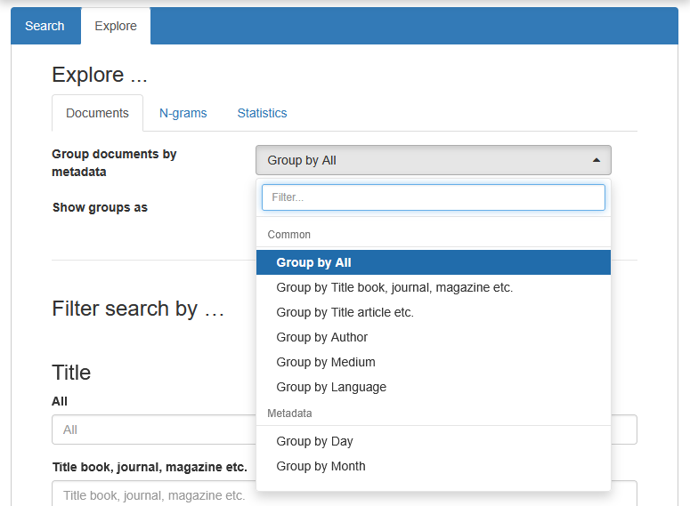
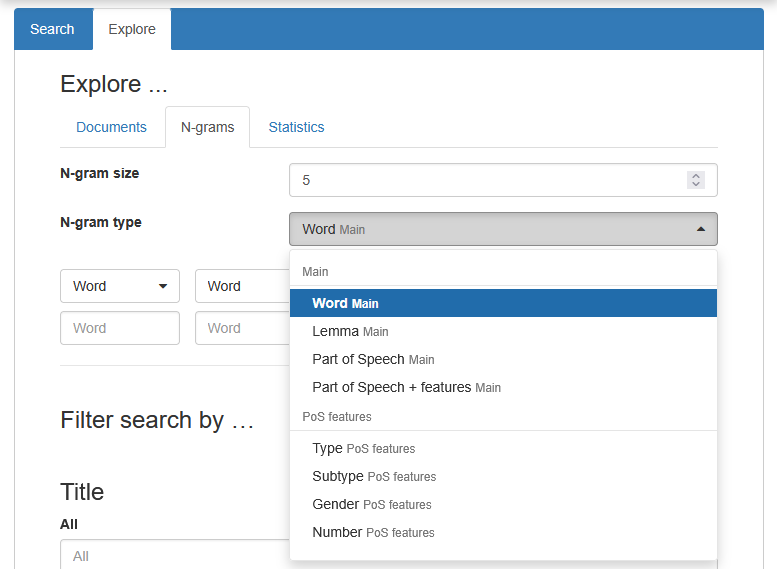
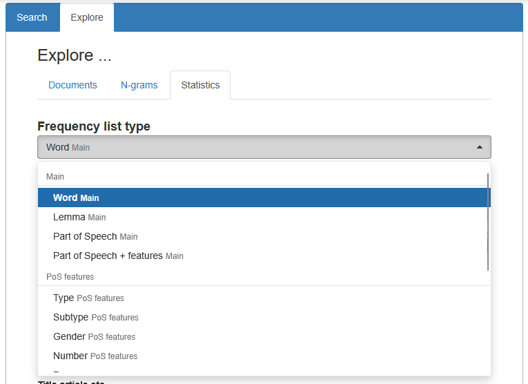

# Explore 

<!-- @include: ../_table_based_layout_tip.md -->


::: tabs
=== Documents

=== N-grams

=== Statistics

:::

## Documents


```js
// "Group documents by metadata" options:
vuexModules.ui.actions.results.shared.groupMetadataIds(['date', 'author']);
// Change default selection:
vuexModules.ui.actions.explore.defaultGroupMetadataId('date'); 

// Show or hide the small labels in the "Group documents by metadata" dropdown (not shown in the screenshot):
vuexModules.ui.actions.dropdowns.groupBy.metadataGroupLabelsVisible(false);
```


## N-grams

```js
// "N-gram type" options:
vuexModules.ui.actions.results.shared.groupAnnotationIds(['word', 'lemma']);
// Change default "N-gram type" selection:
vuexModules.ui.actions.explore.defaultGroupAnnotationId('word');

// Options for the individual field type selectors (the 5 smaller dropdowns): 
vuexModules.ui.actions.explore.searchAnnotationIds(['word', 'lemma']);
// Default selection:
vuexModules.ui.actions.explore.defaultSearchAnnotationId('word');

// Show or hide the small labels in the "N-gram type" dropdown (not shown in the screenshot):
vuexModules.ui.actions.dropdowns.groupBy.annotationGroupLabelsVisible(false);
```

## Statistics

```js
// "Frequency list type" options:
vuexModules.ui.actions.results.shared.groupAnnotationIds(['word', 'lemma']);
// Default selection:
vuexModules.ui.actions.explore.defaultGroupAnnotationId('word');
// Options for the
// Show or hide the small labels in the "Frequency list type" dropdown (not shown in the screenshot):
vuexModules.ui.actions.dropdowns.groupBy.annotationGroupLabelsVisible(false);
```