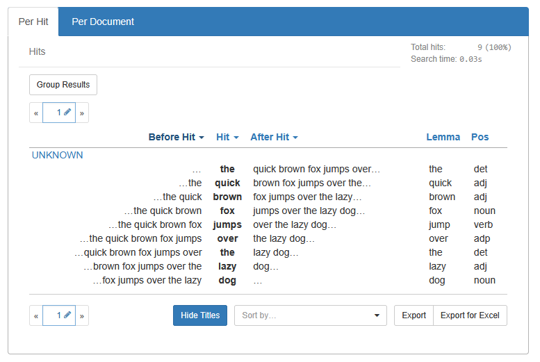
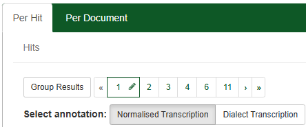
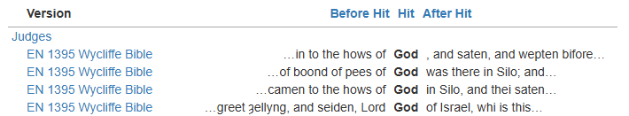
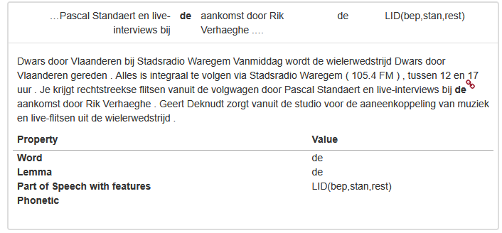
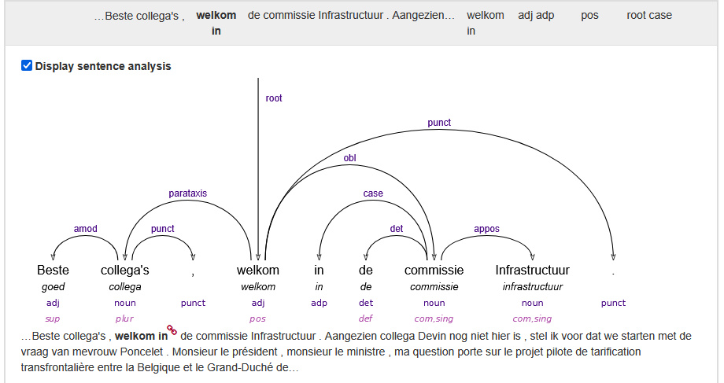
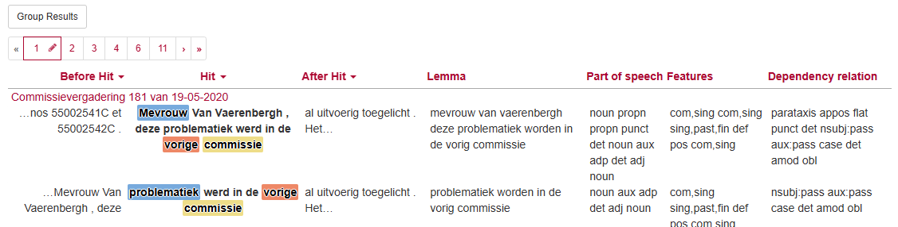

# Hits

<!-- @include: ../_table_based_layout_tip.md -->




## Context

### Set concordance size (`concordanceSize`)

To show more or less of the surrounding document when a hit is expanded.

:::: tabs
== concordance size 10
```js
vuexModules.ui.actions.results.shared.concordanceSize(10)
```

== concordance size 50
```js
vuexModules.ui.actions.results.shared.concordanceSize(50)
```

::::
 
### Set Annotation (`concordanceAnnotationId`)

You can use a different Annotation for searching and displaying, e.g. search for lemmata but show the original text  in the results (or even show markup using `concordanceAsHtml`).

:::: tabs
== Annotation `word`
```js
vuexModules.ui.actions.results.shared.concordanceAnnotationId('word');
```

== Annotation `pos_id`
```js 
vuexModules.ui.actions.results.shared.concordanceAnnotationId('pos_id');
```

::::

#### Allow users to choose the annotation

You can allow users to switch the annotation used for concordances in the hits table. This is useful if you have multiple annotations and want to let users choose which one to display. E.g. one with markup and one without

::: tabs
== Code
```js
vuexModules.ui.actions.results.shared.concordanceAnnotationIdOptions(['word', 'lemma']);
```
== Image

:::

### HTML and markup in Concordances (`concordanceAsHtml`)


You can display concordances (the hit and its context) as HTML in the results table. This is useful if you have indexed snippets of raw XML from your documents (for example, using BlackLab's `captureXml` mode) and want to render them with custom styling.

```js
vuexModules.ui.actions.results.shared.concordanceAsHtml(true)
```

#### Example

Combined with BlackLab's [`captureXml`](https://github.com/instituutnederlandsetaal/BlackLab/blob/9fdc0e146f136287b0c3cca8456b0ef60ce2cbe2/core/src/site/markdown/how-to-configure-indexing.md#indexing-xml) mode, you can index raw XML from your documents into an annotation (e.g., `word_xml`). By enabling `concordanceAsHtml`, the frontend will render the annotation as HTML in the hits table, allowing you to style it with custom CSS.

::: code-group
```xml [Source document]
<w>
  en<strikethrough>de</strikethrough>
</w>
```
```yaml [.blf.yaml]
- name: word_xml
  valuePath: //w
  captureXml: true
```
```ts [Custom JS]
vuexModules.ui.actions.results.shared.concordanceAnnotationId('word_xml')
vuexModules.ui.actions.results.shared.concordanceAsHtml(true)
```
```css [Custom CSS]
strikethrough {
  text-decoration: line-through;
}
```
:::

Will result in the following html
> en<del>de</del>

----

Browser support for non-HTML elements is good, so arbitrary XML should work out of the box, as long as it is well-formed.

::: warning
**USE THIS FEATURE WITH CARE!** It may break your page if the XML contains unexpected or malformed contents.
:::


## Columns and Rows


::: tabs
=== Annotations (shownAnnotationIds)
By default, up to **3 extra columns** (besides the main annotation) are shown. `lemma` and `pos` have hardcoded priority, and will show up first if they exist. Remaining spots are filled up in the order you declared your annotations in the `.blf.yaml`.

```js
// Replace with the annotation IDs you want to display.
vuexModules.ui.actions.results.hits.shownAnnotationIds(['lemma', 'pos', 'your_annotation']);
```

=== Metadata (shownMetadataIds)
Document Metadata is not normally shown in the hits table, but it's possible to add columns through the JS API.

```js
// Replace with the metadata field IDs you want to display.
vuexModules.ui.actions.results.hits.shownMetadataIds(['title', 'author']);
```

=== Titles (getDocumentSummary)
<!-- @include: ./_doc_title_rows.md -->
:::


### Custom column 

You can also add a column with custom content, the content can be computed from a function.

::: code-group
```js [Code]
frontend.customize(corpus => {
  // Enable the column
  corpus.results.hasCustomHitInfoColumn = (results, isParallelCorpus) => {
    return true; // Always show the custom column
  };

  // Provide content for the column
  corpus.results.customHitInfo = (hit, annotatedFieldDisplayName, docInfo) => {
    // Example: Show the document title
    return `${docInfo.title}`;
  };
})
```
<<< @/../../src/frontend/src/utils/customization.ts#docscustomhitinfocolumn [Type definitions]
:::

## Expanded Hit Details

### Annotations in Expanded View (`detailedAnnotationIds`)

Control which annotations are shown in the expanded hit details and in CSV exports:

::: tabs
== Code
```js
vuexModules.ui.actions.results.shared.detailedAnnotationIds(['word', 'lemma', 'pos_full', 'phonetic']);
```
== Image

:::


### Dependency Tree in Expanded View (`dependencies`)


If your corpus has [dependency relations](https://blacklab.ivdnt.org/guide/query-language/relations.html), you can configure which annotations are used in the dependency tree shown in hit details.
We will try to show all dependencies in the sentence, or shown the explicitly searched dependencies.

::: tabs
=== Dependency Tree

=== Annotations
To change which annotations are shown in the dependency tree  
```js
vuexModules.ui.actions.results.shared.dependencies({
  lemma: 'lemma',
  upos: 'upos',
  xpos: 'xpos',

  // Pass a single annotation ID to show one feat, e.g.:
  feats: 'feats',
  
  // or pass an array of feat annotation IDs to show multiple feats, e.g.:
  feats: ['pos_gender', 'pos_number', 'pos_person'], 
});
```
=== Sentence boundary element
You can also set the sentence boundary element for the dependency tree,
this must be a [span](https://blacklab.ivdnt.org/guide/query-language/token-based.html#spans).
We try to autodetect this using various names for 'sentence' (e.g. `s`, `sent`, `sentence`), but you can override this if needed:

```js
vuexModules.ui.actions.search.shared.within.sentenceElement('s');
```

:::

## Highlighting Concordances
Marking parts of your query will highlight the corresponding parts in the hits table. This is useful to visually distinguish different parts of your query, such as the main search term and any modifiers.

We will highlight marked parts of the query, or alternatively, any matched relations when using a relation query.

::: tip
See the [BlackLab docs on relations](https://blacklab.ivdnt.org/guide/query-language/relations.html) for more information on how to use relations in your data and queries.
:::

:::tabs 
== Example Dependency Query
`a:_ --> b:"koe"`  
i.e. "anything" as parent of "koe" (cow) in the dependency tree.

== Example Marked Query
`a:[pos="noun"] []* b:[pos="adj"] c:[pos="noun"] within <s/>`  
i.e. "noun" followed by (eventually) "adj" + "noun" within a sentence boundary element.

:::


You can configure how and what to highlight, if the defauls are not to your liking.

::: code-group
```js [Code]
/** 
 * @param {HighlightSection} matchInfo
 * @returns {'hover' | 'static' | 'none' | null}
 */
corpus.results.matchInfoHighlightStyle = function (matchInfo) {
  if (matchInfo.isRelation) {
    // Show hover highlight for words
    if (matchInfo.relType === 'word-alignment')
      return 'hover';
    // Don't show other relations
    return 'none';
  }
  // Always highlight any named entities captured by our query
  // (e.g. <named-entity/> containing "dog")
  if (matchInfo.key === 'named-entity')
    return 'static';

  // Default highlighting behaviour
  // ("highlight non-relations if there's explicit captures in the query")
  return null;
};
```
<<< @/../../src/frontend/src/pages/search/results/table/hit-highlighting.ts#docsmatchinfohighlightstyle [Type definitions]
:::

## Addons

You can inject custom content (e.g., audio players, buttons, extra info) into the expanded hit details using the `addons` array. 

### Example Addon: Add an audio player to hit details
:::: tabs
== An Audio Play Button

== Type definitions
```ts
type Context = {
  corpus: string,
  docId: string,
  context: BLTypes.BLHitSnippet,
  document: BLTypes.BLDocInfo,
  documentUrl: string,
  wordAnnotationId: string,
  dir: 'ltr'|'rtl',
};

type Widget = {
  name: string;
  component?: string;
  element?: string;
  props?: any;
  content?: string;
  listeners?: any;
};
```
Snippet definitions:  

<<< @/../../src/frontend/src/types/blacklabtypes.ts#docssnippettypes
== Code
```js
vuexModules.ui.getState().results.hits.addons.push(function(context) {
  var snippet = context.context;
  var docId = context.docId;
  var s = 'begintime';
  var e = 'endtime';
  var startString = snippet.before[s].concat(snippet.match[s]).concat(snippet.after[s]).find(v => !!v);
  var endString = snippet.before[e].concat(snippet.match[e]).concat(snippet.after[e]).reverse().find(v => !!v);
  if (!startString && !endString) return undefined;
  var start = startString ? startString.split(':') : undefined;
  start = start ? Number.parseInt(start[0], 10) * 3600 + Number.parseInt(start[1], 10) * 60 + Number.parseFloat(start[2]) : 0;
  var end = endString ? endString.split(':') : undefined;
  end = end ? Number.parseInt(end[0], 10) * 3600 + Number.parseInt(end[1], 10) * 60 + Number.parseFloat(end[2]) : Number.MAX_VALUE;
  return {
    component: 'AudioPlayer',
    name: 'audio-player',
    props: {
      docId: docId,
      startTime: start,
      endTime: end,
      url: config.audioUrlBase + docId + '.mp3'
    },
  }
})
```
::::
## Utils

### Transform Snippets (`transformSnippets`)

Use to replace words, add warnings, or correct data after the fact (e.g. escape sequences), or to do markup in combination with `concordanceAsHtml`.

::: tabs
== Type definitions
```ts

/** E.g. {word: ['words', 'in', 'the', 'hit'], lemma: [...], pos: [...]} */
type SnippetPart = Record<string, string[]>;

interface Snippet {
  before: SnippetPart;
  match: SnippetPart;
  after: SnippetPart;
  // There might be more properties! beware of that.
}

type TransformFunction = (snippet: Snippet) => void;

```
== Example
```js 
vuexModules.ui.actions.results.shared.transformSnippets(snippet => {
  const transform = (...snippets) => snippets.forEach(v => v.word = v.word.map(word => {
    if (word === 'de') return `<span style="text-decoration: underline; text-shadow: 0 0 2px red;">${word}</span>`;
    return word;
  }))
  transform(snippet.before, snippet.match, snippet.after);
});
```
== Before and after

**Before:**


**After:**

:::


### Totals Counter Polling

Control how long and how often the totals counter (spinner) refreshes while waiting for results:
After the timeout, the user will have to manually start the counter again.

::: tabs
== Example
```js
vuexModules.ui.actions.results.shared.totalsTimeoutDurationMs(90000); // 90 seconds
vuexModules.ui.actions.results.shared.totalsRefreshIntervalMs(2000);  // 2 seconds
```
== Image


:::

