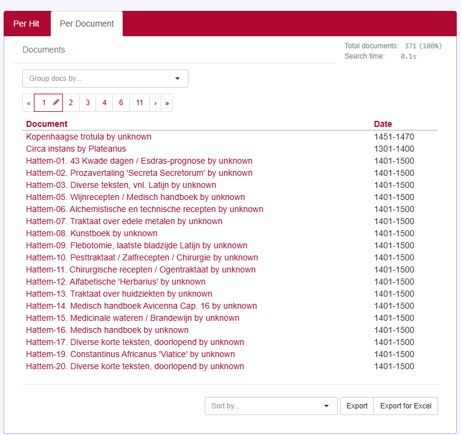

# Docs

<!-- @include: ../_table_based_layout_tip.md -->



## Document titles (`getDocumentSummary`)
<!-- @include: ./_doc_title_rows.md -->

## Columns (`shownMetadataIds`)

To Change the columns shown in the results table, you can use the `shownMetadataIds` property. This is an array of metadata field names that you want to display as columns in the results table.

```js
vuexModules.ui.actions.results.docs.shownMetadatIds(['date'])
```

