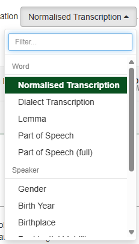
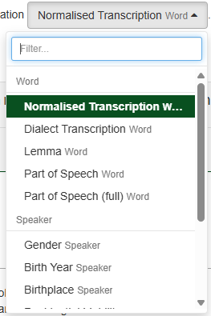

# Sorting and Grouping

<!-- @include: ../_custom_js_tip.md -->

## Options

Set which annotations and metadata are available for sorting and grouping the results.


```js [code]
// For Annotations:
// NOTE: this also controls the "N-gram type" and "Frequency list type" dropdowns in the Explore form.
vuexModules.ui.actions.results.shared.groupAnnotationIds(['word', 'lemma']);
vuexModules.ui.actions.results.shared.sortAnnotationIds(['word', 'lemma']);
// For Metadata: 
// NOTE: this also controls the "Group documents by metadata" dropdown in the Explore form.
vuexModules.ui.actions.results.shared.groupMetadataIds(['date', 'author']);
vuexModules.ui.actions.results.shared.sortMetadataIds(['date', 'author']);
```


## Labels

Hide or show the small labels next to the options in the dropdowns.

::: tabs
== code
```js 
vuexModules.ui.actions.dropdowns.groupBy.annotationGroupLabelsVisible(true)
vuexModules.ui.actions.dropdowns.groupBy.metadataGroupLabelsVisible(true)

vuexModules.ui.actions.dropdowns.sortBy.annotationGroupLabelsVisible(true)
vuexModules.ui.actions.dropdowns.sortBy.metadataGroupLabelsVisible(true)
```
== Hidden Labels

== Visible labels

:::