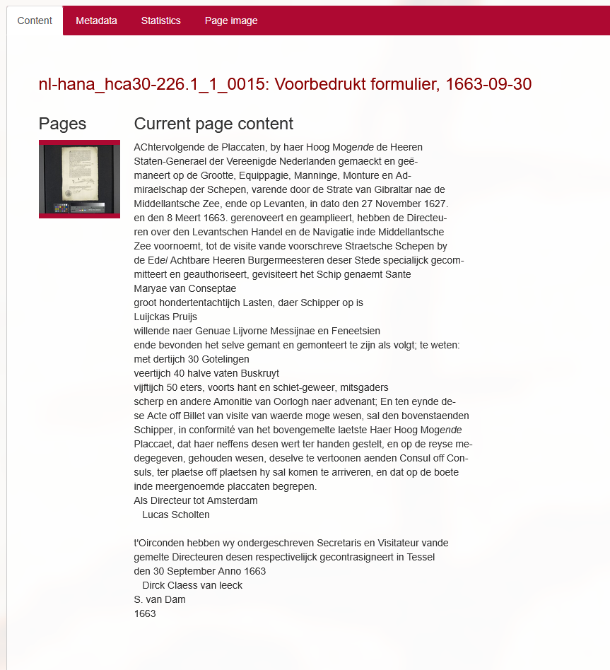

# Document contents

You can supply custom XSLT files to transform the document contents and metadata.

::: tip Only for XML
We try to detect whether documents are actually XML before applying the transformation.
Documents of other formats will be displayed on the page as unformatted text.  
Metadata transformation is always available, regardless of the document format.
:::


::: details File location
<FileTree hl=6,7>
<!-- @include: ../example_customization_folder_layout.txt -->
</FileTree>
:::

::: details Example customized document

:::

There are two files that are used to transform the document contents and metadata respectively: 
- `article.xsl` for the document contents
- `meta.xsl` for the document metadata


## Default behavior

Normally you don't have to write your own `article.xsl` file.  
BlackLab has the ability to generate a default transformation based on the `.blf.yaml` config.
If that fails (because the `.blf.yaml` no longer exists, for example) we will fall back to just outputting all `text()` nodes.

For metadata we provide a built-in `meta.xsl` that just outputs a table with all metadata in your documents.

## Document Contents (`article.xsl`)

1. First, create an `article.xsl` file in the customization directory (see above).
2. When the user opens a document, the contents of the document will be ran through the xslt processor (`saxon 10` currently) before being shown to the user.

::: warning Varying document formats in the same corpus
All documents are transformed using the same `article.xsl` file.  
So if your corpus contains document with wildly different XML content, your `article.xsl` file will have to detect and handle this appropriately.  
:::


::: tip Splitting up your XSLT
It's possible to import other XSLT files in your `article.xsl` file.   
You can put dependencies anywhere, as long as they are within the `corporaInterfaceDataDir` directory.
E.g. import a shared library xslt file from the `default` directory:
<FileTree>
/etc/projectConfigs/  the location set in the corporaInterfaceDataDir setting 
	corpus-1/
		article.xsl
	_shared/
		tei.xsl 
		folia.xsl
</FileTree>

```xsl [article.xsl]
<!-- article.xsl -->
<xsl:import href="../_shared/tei.xsl" />
```
:::

## Document Metadata (`meta.xsl`)

The `meta.xsl` file is used to transform the metadata of documents in your corpus. The output is shown under the metadata tab on the document's page. You can customize this file to change how the metadata is displayed. The metadata is actually the metadata BlackLab has about the document, _not from the document contents_.  
The built-in `meta.xsl` file will simply generate a table with all the metadata fields and their values, which is usually sufficient.

:information_source: [BlackLab's document metadata schema](https://blacklab.ivdnt.org/server/rest-api/corpus/docs/pid/get.html#document-metadata)

## User corpora, priority, fallbacks

Like for all corpora files, the `default` directory is also used for the `article.xsl` and `meta.xsl` files.   
There is a special behavior, where the `article.xsl` file name can be suffixed with a specifier, e.g. `article_tei.xsl` or `article_folia.xsl`. 

The suffix should match exactly the id of the format used to create the user corpus.
This is the name of the `.blf.yaml` file, minus the extension. 
This allows you to provide some extra built-ins for data formats you might expect your users to upload.

::: tabs
=== Example
| .blf.yaml file       | Format name | article.xsl file        |
|----------------------|-------------|-------------------------|
| `tei.blf.yaml`       | `tei`       | `article_tei.xsl`       |
| `folia.blf.yaml`     | `folia`     | `article_folia.xsl`     |
| `myformat.blf.yaml`  | `myformat`  | `article_myformat.xsl`  |
| - (any)              | - (any)     | `article.xsl`           |
=== Folder structure

<FileTree>
/etc/projectConfigs
  default
    article_tei.xsl
    article_folia.xsl
    article_myformat.xsl
    article.xsl
</FileTree>
:::

### Priority of XSLT files

The first match will be chosen:
1. The `article_<format>.xsl` file in the corpus's own directory (e.g. `/etc/projectConfigs/corpus-1/article.xsl`).
2. The `article_<format>.xsl` file in the default directory (e.g. `/etc/projectConfigs/default/article_tei.xsl`).
4. The `article.xsl` file in the corpus's own directory (e.g. `/etc/projectConfigs/corpus-1/article.xsl`).
5. The `article.xsl` file in the default directory (e.g. `/etc/projectConfigs/default/article.xsl`).
6. The BlackLab generated file (if available)
7. The `article_<format>.xsl` built-in 
8. The `article.xsl` built-in

