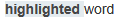
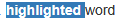
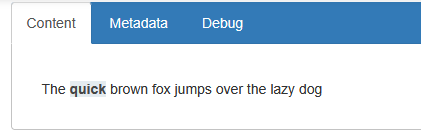
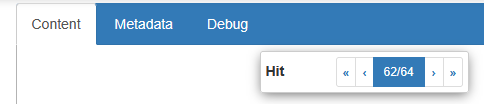

# Highlighting hits






BlackLab will insert `<hl></hl>` tags around all hits in your document.  
The default settings will transform these into `<span class="hl"></span>` elements, which will be styled with a background color in the default CSS.  
Additionally the paginator will allow you to jump to the next or previous hit in the document, it relies on the `hl` class to find the hits in the document.

::: warning
:warning: It's important that you use the `hl` class for hits in your document, as the interface relies on this to highlight hits in the document view.  
:::


### Example setup for correctly highlighting hits using a custom `article.xsl` file:	

::: tabs
=== document.xml
```xml
<doc>
	<w>The</w>
	<w>quick</w>
	<w>brown</w>
	<w>fox</w>
	<w>jumps</w>
	<w>over</w>
	<w>the</w>
	<w>lazy</w>
	<w>dog</w>
</doc>
```
=== blacklab response for "quick"
```xml
<doc>
	<w>The</w>
	<hl><w>quick</w></hl>
	<w>brown</w>
	<w>fox</w>
	<w>jumps</w>
	<w>over</w>
	<w>the</w>
	<w>lazy</w>
	<w>dog</w>
</doc>
```
=== article.xsl
```xsl
<xsl:stylesheet xmlns:xsl="http://www.w3.org/1999/XSL/Transform" version="1.0">
	<xsl:template match="w">
		<span><xsl:value-of select="."></span>
	</xsl:template>

	<xsl:template match="hl">
		<span class="hl"><xsl:apply-templates/></span>
	</xsl:template>
</xsl:stylesheet>
```
=== output.html
```html
<span>The</span>
<span class="hl"><span>quick</span></span>
<span>brown</span>
<span>fox</span>
<span>jumps</span>
<span>over</span>
<span>the</span>
<span>lazy</span>
<span>dog</span>
```
=== result
The above setup will result in the following page:

:::


## The paginator

It's important that you follow the convention of using `hl` as class for the hits, as the paginator element that lets you jump to the next or previous hit in the document relies on this.
We simply look for elements with the class `hl` and let you jump to the next or previous one.

The paginator will hide itself if it can't find any hits in the document.
	



