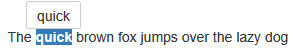
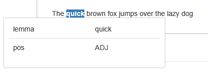
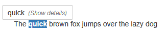
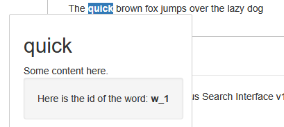

# Tooltips on words

## Basic Tooltip



Basic tooltips on words need 3 things:
- the `word` class 
- the `data-toggle="tooltip"` attribute 
- the `title` attribute 
```html
<span class="title" data-toggle="tooltip" title="Tooltip text">Hover over me</span>
```

An example config could be the following:

::: code-group

```xml [document]
<doc>
  <w xml:id="w_0" pos="DET"   lemma="the">The</w>
  <w xml:id="w_1" pos="ADJ"   lemma="quick">quick</w>
  <w xml:id="w_2" pos="ADJ"   lemma="brown">brown</w>
  <w xml:id="w_3" pos="NOUN"  lemma="fox">fox</w>
  <w xml:id="w_4" pos="VERB"  lemma="jump">jumps</w>
  <w xml:id="w_5" pos="ADP"   lemma="over">over</w>
  <w xml:id="w_6" pos="DET"   lemma="the">the</w>
  <w xml:id="w_7" pos="ADJ"   lemma="lazy">lazy</w>
  <w xml:id="w_8" pos="NOUN"  lemma="dog">dog</w>
</doc>
```

```xsl [article.xsl]
<xsl:stylesheet xmlns:xsl="http://www.w3.org/1999/XSL/Transform" version="1.0">
  <xsl:template match="w">
    <span class="word" data-toggle="tooltip" title="{@lemma}"><xsl:value-of select="."/></span>
  </xsl:template>

  <xsl:template match="hl">
    <span class="hl"><xsl:apply-templates/></span>
  </xsl:template>
</xsl:stylesheet>
```

```html [output]
<span class="word" data-toggle="tooltip" title="the">The</span>
<span class="hl"><span class="word" data-toggle="tooltip" title="quick">quick</span></span>
<span class="word" data-toggle="tooltip" title="brown">brown</span>
<span class="word" data-toggle="tooltip" title="fox">fox</span>
<span class="word" data-toggle="tooltip" title="jump">jumps</span>
<span class="word" data-toggle="tooltip" title="over">over</span>
<span class="word" data-toggle="tooltip" title="the">the</span>
<span class="word" data-toggle="tooltip" title="lazy">lazy</span>
<span class="word" data-toggle="tooltip" title="dog">dog</span>
```

:::


## Tooltips with more info




You can also display more than one attribute in the tooltip. To do this, use `data-*` attributes instead of `title` for your word elements.  
As before, also apply the `word` class and `data-toggle="tooltip"` attribute.

::: code-group
```xml [document.xml]
<doc>
  <w xml:id="w_0" pos="DET"   lemma="the">The</w>
  <w xml:id="w_1" pos="ADJ"   lemma="quick">quick</w>
  <w xml:id="w_2" pos="ADJ"   lemma="brown">brown</w>
  <w xml:id="w_3" pos="NOUN"  lemma="fox">fox</w>
  <w xml:id="w_4" pos="VERB"  lemma="jump">jumps</w>
  <w xml:id="w_5" pos="ADP"   lemma="over">over</w>
  <w xml:id="w_6" pos="DET"   lemma="the">the</w>
  <w xml:id="w_7" pos="ADJ"   lemma="lazy">lazy</w>
  <w xml:id="w_8" pos="NOUN"  lemma="dog">dog</w>
</doc>
```

```xsl [article.xsl]
<xsl:stylesheet xmlns:xsl="http://www.w3.org/1999/XSL/Transform" version="1.0">
	<xsl:template match="w">
		<span class="word" data-toggle="tooltip" data-lemma="{@lemma}" data-pos="{@pos}"><xsl:value-of select="."/></span>
	</xsl:template>

	<xsl:template match="hl">
		<span class="hl"><xsl:apply-templates/></span>
	</xsl:template>
</xsl:stylesheet>
```

```html [output] 
<span class="word" data-toggle="tooltip" data-lemma="the" data-pos="DET">The</span>
<span class="hl active"><span class="word" data-toggle="tooltip" data-lemma="quick" data-pos="ADJ">quick</span></span>
<span class="word" data-toggle="tooltip" data-lemma="brown" data-pos="ADJ">brown</span>
<span class="word" data-toggle="tooltip" data-lemma="fox" data-pos="NOUN">fox</span>
<span class="word" data-toggle="tooltip" data-lemma="jump" data-pos="VERB">jumps</span>
<span class="word" data-toggle="tooltip" data-lemma="over" data-pos="ADP">over</span>
<span class="word" data-toggle="tooltip" data-lemma="the" data-pos="DET">the</span>
<span class="word" data-toggle="tooltip" data-lemma="lazy" data-pos="ADJ">lazy</span>
<span class="word" data-toggle="tooltip" data-lemma="dog" data-pos="NOUN">dog</span>
```
 
:::


## Expandable Tooltips

::: tabs
== Collapsed

== Expanded

:::


If you want full control of the contents of the toolip, you can use the `data-tooltip-preview` and `data-tooltip-content` attributes. In this case, remove the `data-toggle="tooltip"` attribute.

This allows you to show a short preview on hover, and allow users to expand for more details.
You can then put any HTML inside the tooltip.

::: warning
Make sure to escape any HTML inside the `data-tooltip-preview` and `data-tooltip-content` attributes!
The escape code below will work for most cases, but you may need to adjust it for your own use case.
:::

::: code-group
```xml [document.xml]	
<doc>
  <w xml:id="w_0" pos="DET"   lemma="the">The</w>
  <w xml:id="w_1" pos="ADJ"   lemma="quick">quick</w>
  <w xml:id="w_2" pos="ADJ"   lemma="brown">brown</w>
  <w xml:id="w_3" pos="NOUN"  lemma="fox">fox</w>
  <w xml:id="w_4" pos="VERB"  lemma="jump">jumps</w>
  <w xml:id="w_5" pos="ADP"   lemma="over">over</w>
  <w xml:id="w_6" pos="DET"   lemma="the">the</w>
  <w xml:id="w_7" pos="ADJ"   lemma="lazy">lazy</w>
  <w xml:id="w_8" pos="NOUN"  lemma="dog">dog</w>
</doc>
```

```xml [article.xsl]
<xsl:stylesheet xmlns:xsl="http://www.w3.org/1999/XSL/Transform" version="1.0">
	<xsl:template match="w">
		<xsl:variable name="tooltip"><xsl:call-template name="tooltip"/></xsl:variable>

		<span class="word">
			<xsl:attribute name="data-tooltip-preview" select="@lemma"/>
			<xsl:attribute name="data-tooltip-content" select="replace(replace(serialize($tooltip), '&amp;', '&amp;amp;'), '&quot;', '&amp;quot;')"/>
			<xsl:value-of select="."/>
		</span>
	</xsl:template>

	<xsl:template name="tooltip">
		<h2><xsl:value-of select="@lemma"/></h2>
		Some content here.
		<div class="well">
			Here is the id of the word: <strong><xsl:value-of select="@xml:id"/></strong>
		</div>
	</xsl:template>
	
	<xsl:template match="hl">
		<span class="hl"><xsl:apply-templates/></span>
	</xsl:template>
</xsl:stylesheet>
```

```html [output]
  <span class="word" data-tooltip-preview="the" data-tooltip-content="<h2>the</h2>
		Some content here.
		<div class=&amp;quot;well&amp;quot;>
			Here is the id of the word: <strong>w_0</strong></div>">The</span>
  <span class="hl active"><span class="word" data-tooltip-preview="quick" data-tooltip-content="<h2>quick</h2>
		Some content here.
		<div class=&amp;quot;well&amp;quot;>
			Here is the id of the word: <strong>w_1</strong></div>">quick</span></span>
  <span class="word" data-tooltip-preview="brown" data-tooltip-content="<h2>brown</h2>
		Some content here.
		<div class=&amp;quot;well&amp;quot;>
			Here is the id of the word: <strong>w_2</strong></div>">brown</span>
  <span class="word" data-tooltip-preview="fox" data-tooltip-content="<h2>fox</h2>
		Some content here.
		<div class=&amp;quot;well&amp;quot;>
			Here is the id of the word: <strong>w_3</strong></div>">fox</span>
  <span class="word" data-tooltip-preview="jump" data-tooltip-content="<h2>jump</h2>
		Some content here.
		<div class=&amp;quot;well&amp;quot;>
			Here is the id of the word: <strong>w_4</strong></div>">jumps</span>
  <span class="word" data-tooltip-preview="over" data-tooltip-content="<h2>over</h2>
		Some content here.
		<div class=&amp;quot;well&amp;quot;>
			Here is the id of the word: <strong>w_5</strong></div>">over</span>
  <span class="word" data-tooltip-preview="the" data-tooltip-content="<h2>the</h2>
		Some content here.
		<div class=&amp;quot;well&amp;quot;>
			Here is the id of the word: <strong>w_6</strong></div>">the</span>
  <span class="word" data-tooltip-preview="lazy" data-tooltip-content="<h2>lazy</h2>
		Some content here.
		<div class=&amp;quot;well&amp;quot;>
			Here is the id of the word: <strong>w_7</strong></div>">lazy</span>
  <span class="word" data-tooltip-preview="dog" data-tooltip-content="<h2>dog</h2>
		Some content here.
		<div class=&amp;quot;well&amp;quot;>
			Here is the id of the word: <strong>w_8</strong></div>">dog</span>
``` 
:::

