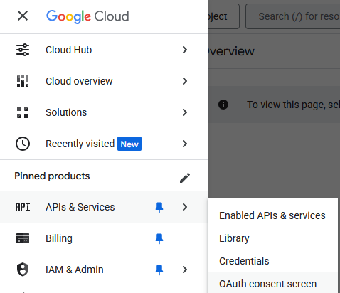
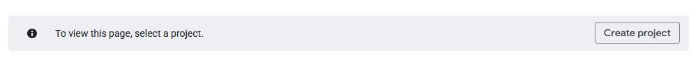
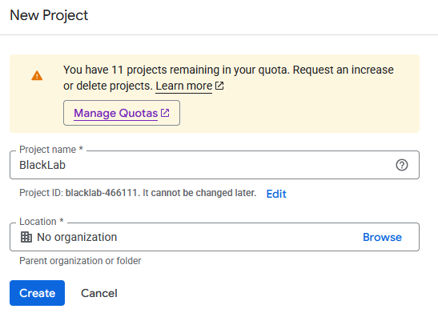
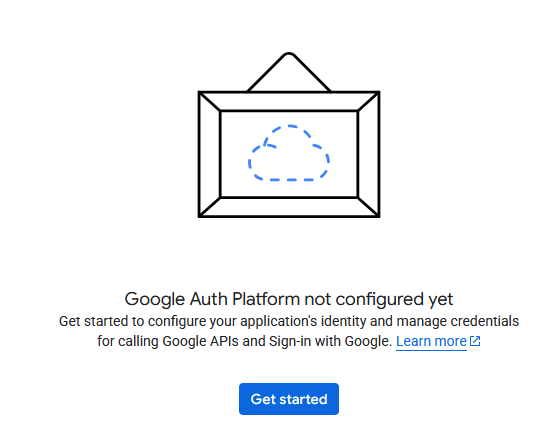
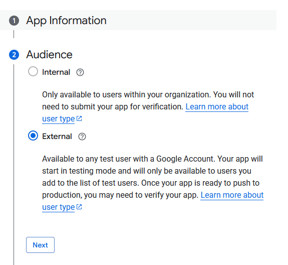
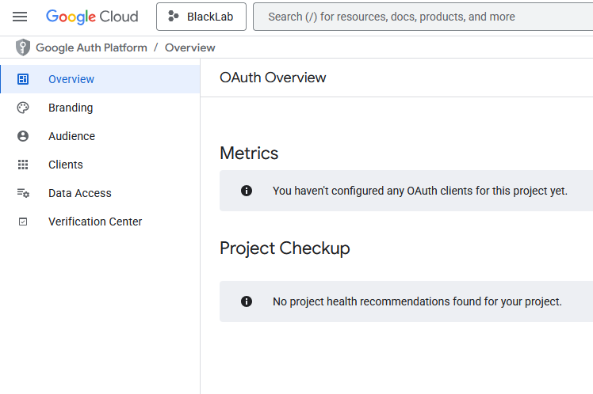
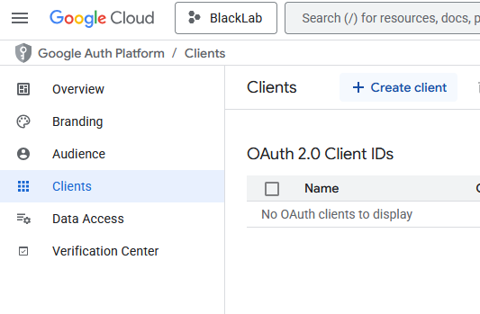
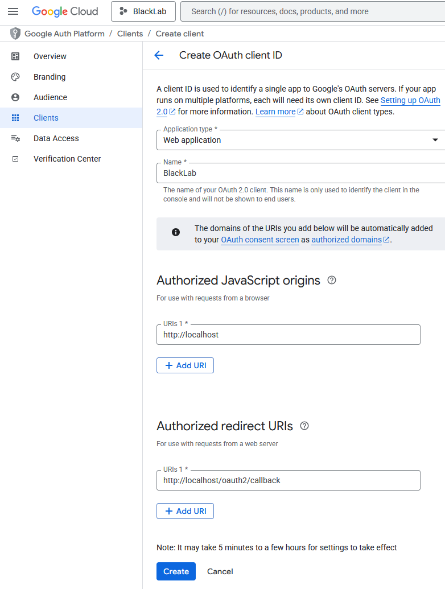
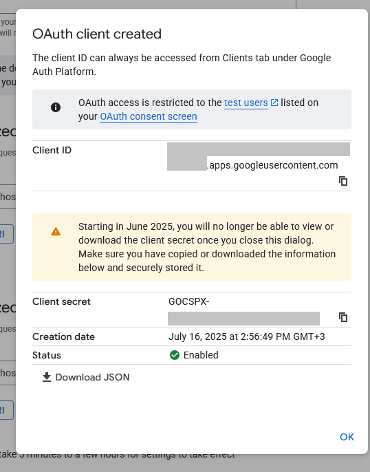
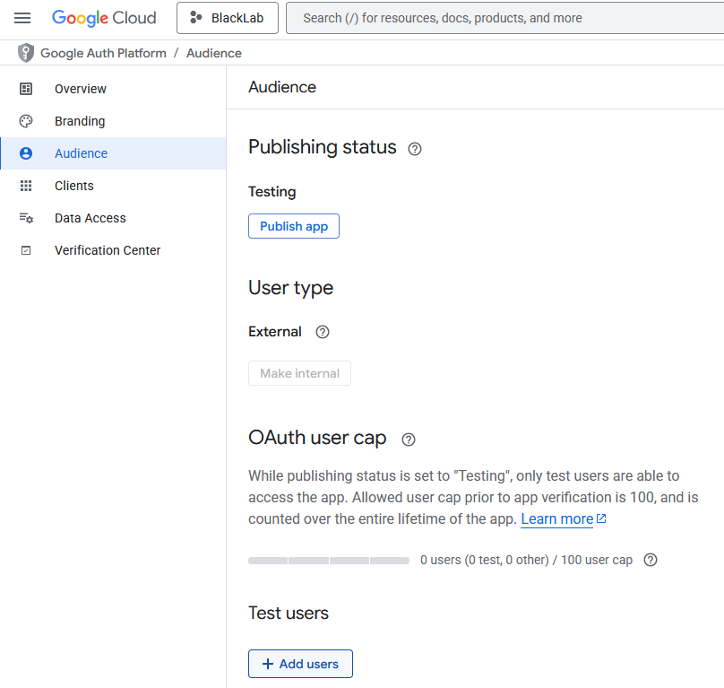

# Authentication

::: info :information_source: **BlackLab does not support user registration and login natively.**
BlackLab relies on external software such as proxies to implement user authentication.  
BlackLab itself relies on forwarded headers or request attributes (typically `remote-user`) to know who you are.
:::

 
Below is an example of how to set up such a proxy to handle authentication for BlackLab.   
We'll be using **OAuth2 Proxy** to connect to **Google** using **OpenID Connect**.  
OAuth2 Proxy will sit in front of BlackLab and handle authentication, forwarding the user's email to BlackLab and the Frontend.

If you would like to use a different authentication provider, you can adapt the configuration accordingly.
There is documentation and support for many providers, see [OAuth2 Proxy documentation](https://oauth2-proxy.github.io/oauth2-proxy/configuration/providers/).


## Create the configuration files

Create the following files in a directory of your choice, e.g. `blacklab-auth`:

::: code-group
```yaml [docker-compose.yml]
services:
  blacklab:
    image: instituutnederlandsetaal/blacklab-frontend:4
    build: 
      context: ..
      dockerfile: docker/frontend-bls.dockerfile
    volumes:
      - ./corpora:/data/index
      - ./corpora-user:/data/user-index
      - ./configs:/etc/blacklab/projectconfigs
      - ./blacklab-frontend.properties:/etc/blacklab/blacklab-frontend.properties
      - ./blacklab-server.yaml:/etc/blacklab/blacklab-server.yaml
    environment: 
      - JAVA_OPTS="-Xmx4g"

  oauth2-proxy: 
    image: quay.io/oauth2-proxy/oauth2-proxy # bitnami version on dockerhub doesn't support upstreams through env vars
    container_name: oauth2-proxy
    depends_on: 
      - redis
    ports: 
      - 80:80

    environment: 
        OAUTH2_PROXY_HTTP_ADDRESS: 0.0.0.0:80
        OAUTH2_PROXY_UPSTREAMS: http://blacklab:8080/

        # Generic OpenId Connect, if you have a specific provider in mind, 
        # See https://oauth2-proxy.github.io/oauth2-proxy/configuration/providers/
        OAUTH2_PROXY_PROVIDER: google
        
        # Change these to your own values
        OAUTH2_PROXY_CLIENT_ID: xxxxx.apps.googleusercontent.com
        OAUTH2_PROXY_CLIENT_SECRET: GOCSPX-xxxxx
        OAUTH2_PROXY_COOKIE_SECRET: thismustbe16byte # unused as we're using redis, but required anyway
        OAUTH2_PROXY_OIDC_ISSUER_URL: https://accounts.google.com/ # e.g. https://accounts.google.com/ (the proxy will automatically append .well-known/openid-configuration to this URL)
        OAUTH2_PROXY_REDIRECT_URL: http://localhost/oauth2/callback # domain is where you'll be serving blacklab-frontend/blacklab, path should always be /oauth2/callback. This is the URL you'll need to set in your OIDC provider callback setting
        OAUTH2_PROXY_EMAIL_DOMAINS: "*" # can be used to restrict access to users with a specific email domain (such as your employer or institution's domain)

        # Redis settings, these should work
        OAUTH2_PROXY_SESSION_STORE_TYPE: redis
        OAUTH2_PROXY_REDIS_CONNECTION_URL: redis://redis:6379


  redis:
    image: redis:7.0-alpine
    container_name: redis
```
```yaml [blacklab-server.yaml]
configVersion: 2
indexLocations:
- /data/index
userIndexes: /data/user-index

# How to determine current user
# (you only need this if you want per-user private indices or authorization)
authentication:
  system: 
    class: AuthRequestValue
    # attribute|header|parameter
    type: header
    # name of the attribute, header or parameter that contains the user id, for oauth2-proxy, the email is in the x-forwarded-email header
    name: x-forwarded-email
```
```properties [blacklab-frontend.properties]
# name of the attribute, header or parameter that contains the user id, for oauth2-proxy, the email is in the x-forwarded-email header
auth.source.type=header
auth.source.name=x-forwarded-email
auth.target.type=header
auth.target.name=x-forwarded-email
```
:::


## Create a Google Project

::: tip Other providers
For other OpenID Connect providers, the steps will be similar, but the exact configuration may vary.
See the [OAuth2 Proxy documentation](https://oauth2-proxy.github.io/oauth2-proxy/configuration/providers/) for more details on how to configure other providers.
:::

Google needs some info before they hand over the user information to your application.  
We will need to create a *Client* and a *Project* in the Google Cloud Console.  
Google will then give us a *Client ID* and a *Client Secret* that we can use in our configuration.  


### 1. Create the project

Go to the [Google Cloud Console](https://console.cloud.google.com/).

Open the menu at the top left, and go to **APIs & Services > OAUTH consent screen**.  
You should be prompted to create a new project if you don't have one yet.

::: tabs
=== Location in the menu

=== Create a new project



Name your project however you like
:::

### 2. Add some details

Before you can enable the login, Google needs some details.  
Navigate to the OAUTH section if you aren't there: **APIs & Services > OAUTH consent screen** (see above for a screenshot).

::: tabs
=== Prompt
You should be prompted to add some details.



=== Add details

Set the **Audience** type to **External**.  
The rest is up to you



=== Auth dashboard
You should now see the OAUTH dashboard, where you can add a client.



:::

### 3. Create the OAuth client

::: warning :warning: IMPORTANT
Make sure to save the `Client ID` and `Client Secret` you get at the end of this step, if you lose them, you will have to create a new client.
:::

:::: tabs
=== Create Client
Navigate to **Clients** and click **Create client**.


=== Client settings

Enter the details for your client.  

##### Use the following settings:

| Setting                      | Value                                   | Explanation                           |
|------------------------------|-----------------------------------------|---------------------------------------|
| Application type             | **Web application**                     | The type of application you're building, this influences how users interact with the login screen. BlackLab Frontend is a website, so select **Web Application** |
| Name                         | **BlackLab**                            | The name of your application.         |
| Authorized JavaScript origins| **http:\/\/localhost**                  | The base URL of our application, for now we're just testing, so localhost. |
| Authorized redirect URIs     | **http:\/\/localhost/oauth2/callback**  | The URIs that are allowed to receive responses from the OAuth 2.0 server. Where Google will send details after login. The url **/oauth2/callback** is a special location in **oauth2-proxy** where it handles logins. |


=== Screenshot



=== Client created

**Save the Client ID and Client Secret**

::::


### 4. Add a test user

Go to the **Audience** section of the Google Project, and add yourself as a test user.

Until we publish the project, only test users can log in.


::: tabs
=== Add a test user

::: 


### 5. Copy the Client ID and Client Secret into the `docker-compose.yml` file

```yml

oauth2-proxy: 
    image: quay.io/oauth2-proxy/oauth2-proxy # bitnami version on dockerhub doesn't support upstreams through env vars
    container_name: oauth2-proxy
    depends_on: 
      - redis
    ports: 
      - 80:80

   environment: 
      OAUTH2_PROXY_HTTP_ADDRESS: 0.0.0.0:80
      OAUTH2_PROXY_UPSTREAMS: http://blacklab:8080/

      # Generic OpenId Connect, if you have a specific provider in mind, 
      # See https://oauth2-proxy.github.io/oauth2-proxy/configuration/providers/
      OAUTH2_PROXY_PROVIDER: google
      
      # Change these to your own values
      OAUTH2_PROXY_CLIENT_ID: xxxxx.apps.googleusercontent.com # [!code ++]
      OAUTH2_PROXY_CLIENT_SECRET: GOCSPX-xxxxx # [!code ++]

```

### 6. Try it out
Start the containers
```bash
docker-compose up -d
```
Now you can access the BlackLab Frontend at `http://localhost/blacklab-frontend` and the BlackLab Server API at `http://localhost/blacklab-server`.
You should be prompted to log in with your Google account.


### 7. Moving to production, using other Identity Providers, etc.

To move to production, you will need to set up a domain name and SSL certificate, and configure the OAuth2 Proxy to use that domain name.
Generally you'll need to change *at least* the following settings:
- In `docker-compose.yml` 
  - `OAUTH2_PROXY_COOKIE_SECRET` to a random 16-byte string
  - `OAUTH2_PROXY_REDIRECT_URL` to your domain name, the path should still be **/oauth2/callback**
- In the Google Project
  - `Authorized redirect URIs` to your domain name, the path should still be **/oauth2/callback**
  - `Authorized JavaScript origins` to your domain name, optionally with the path of your Frontend instance, **e.g. my-domain.com/blacklab-frontend**
  - Promote the project to production, so that other users besides your test user can log in.