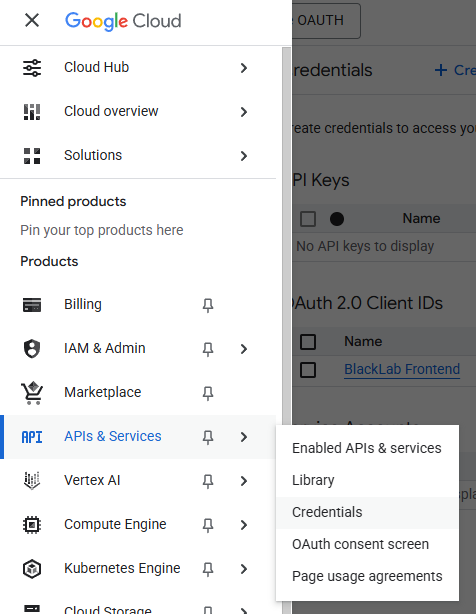
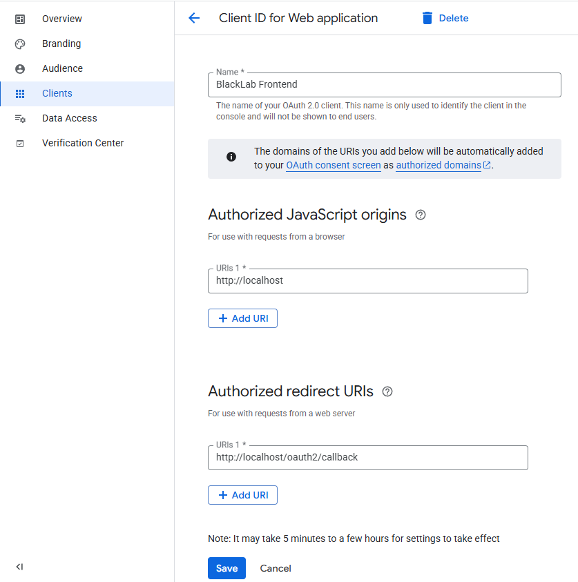
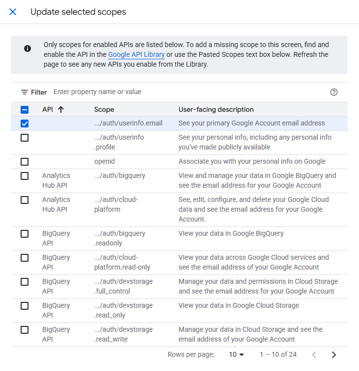
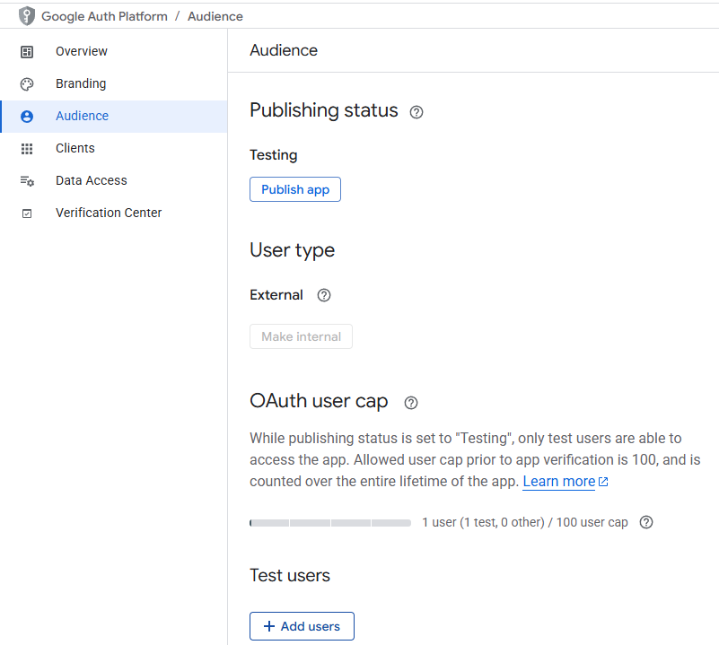

# Authentication

Below is an example of how to set up authentication for BlackLab using OAuth2 Proxy with OpenID Connect.  
The oauth-proxy container will allow you to connect to an OpenID Connect provider (like Google, GitHub, etc.) to authenticate users.


This setup allows you to secure access to BlackLab and the BlackLab Frontend and the BlackLab server.

Create the following files in a directory of your choice, e.g. `blacklab-auth`:

::: code-group
```yaml [docker-compose.yml]
services: 
services:
  blacklab:
    image: instituutnederlandsetaal/blacklab-frontend:dev
    build: 
      context: ..
      dockerfile: docker/frontend-bls.dockerfile
    ports: 
      - 8080:8080
    volumes:
      - ./corpora:/data/index
      - ./corpora-user:/data/user-index
      - ./configs:/etc/blacklab/projectconfigs
      - ./blacklab-frontend.properties:/etc/blacklab/blacklab-frontend.properties
      - ./blacklab-server.yaml:/etc/blacklab/blacklab-server.yaml
    environment: 
      - JAVA_OPTS="-Xmx4g"

  oauth2-proxy: 
    image: quay.io/oauth2-proxy/oauth2-proxy # bitnami version on dockerhub doesn't support upstreams through env vars
    container_name: oauth2-proxy
    depends_on: 
      - redis
    ports: 
      - 80:80

   environment: 
      OAUTH2_PROXY_HTTP_ADDRESS: 0.0.0.0:80
      OAUTH2_PROXY_UPSTREAMS: http://blacklab:8080/

      # Generic OpenId Connect, if you have a specific provider in mind, 
      # See https://oauth2-proxy.github.io/oauth2-proxy/configuration/providers/
      OAUTH2_PROXY_PROVIDER: google
      
      # Change these to your own values
      OAUTH2_PROXY_CLIENT_ID: xxxxx.apps.googleusercontent.com
      OAUTH2_PROXY_CLIENT_SECRET: GOCSPX-xxxxx
      OAUTH2_PROXY_COOKIE_SECRET: thismustbe16byte # unused as we're using redis, but required anyway
      OAUTH2_PROXY_OIDC_ISSUER_URL: https://accounts.google.com/ # e.g. https://accounts.google.com/ (the proxy will automatically append .well-known/openid-configuration to this URL)
      OAUTH2_PROXY_REDIRECT_URL: http://localhost/oauth2/callback # domain is where you'll be serving blacklab-frontend/blacklab, path should always be /oauth2/callback. This is the URL you'll need to set in your OIDC provider callback setting
      OAUTH2_PROXY_EMAIL_DOMAINS: "*" # can be used to restrict access to users with a specific email domain (such as your employer or institution's domain)

      # Redis settings, these should work
      OAUTH2_PROXY_SESSION_STORE_TYPE: redis
      OAUTH2_PROXY_REDIS_CONNECTION_URL: redis://redis:6379


  redis:
    image: redis:7.0-alpine
    container_name: redis
```
```yaml [blacklab-server.yml]
configVersion: 2
indexLocations:
- /data/index
userIndexes: /data/user-index

# How to determine current user
# (you only need this if you want per-user private indices or authorization)
authentication:
  system: 
    class: AuthRequestAttribute
    attributeName: x-forwarded-email
    attributeType: header
```
```properties [blacklab-frontend.properties]
# blacklab-frontend.properties
auth.source.type=header
auth.source.name=x-forwarded-email
auth.target.type=header
auth.target.name=x-forwarded-email
```
:::


Follow the steps detailed in the [OAuth2 Proxy documentation](https://oauth2-proxy.github.io/oauth2-proxy/configuration/providers/google/#usage) to set up a project in Google (in this example). The exact steps may vary depending on the OpenID Connect provider you choose, but the general process is similar.

Once you have created a project, navigate to the **Credentials** section of the Google Cloud Console. Here, you will create a new OAuth 2.0 client ID.

::: warning :warning: IMPORTANT
Make sure to save the `Client ID` and `Client Secret` you get from the OpenID Connect provider, as you will need them to configure the `oauth2-proxy` container.  
Usually you cannot retrieve these values again after you create the client, so if you lose them, you will have to create a new client.
:::



In the `Clients` screen, enter the following values in the Google project configuration:
- **Authorized JavaScript origins**: `http://localhost`  
  This is the domain where your BlackLab and BlackLab Frontend will be served. We will change this later.
- **Authorized redirect URIs**: `http://localhost/oauth2/callback`  
  This is where Google will redirect after login, and where the oauth2-proxy container will handle the callback. We will change this later.



Next, in the `Data Access` section of the Google project, you will need to add the `email` scope. This is necessary to retrieve the user's email address after authentication.


Finally, add yourself as a test user in the Google project. This is necessary to test the authentication flow. 
This setting is located in the `Audience` section of the Google Project.



Now, replace the placeholders in the `docker-compose.yml` file with the values you obtained from the OpenID Connect provider:
- **Client ID**: The unique identifier for your application. You will need to enter this in the `OAUTH2_PROXY_CLIENT_ID` environment variable.
- **Client Secret**: A secret key used to authenticate your application. You will need to enter this in the `OAUTH2_PROXY_CLIENT_SECRET` environment variable.
- **Issuer URL**: The URL of the OpenID Connect provider. For Google, this is usually `https://accounts.google.com/`. You will need to enter this in the `OAUTH2_PROXY_OIDC_ISSUER_URL` environment variable.


Start the docker containers and go to `http://localhost/blacklab-frontend` in your browser. You should be redirected to the OpenID Connect provider's login page. After logging in, you will be redirected back to the BlackLab Frontend.

To move to production, you will need to change the `Authorized JavaScript origins` and `Authorized redirect URIs` in the OpenID Connect provider's configuration to match your production domain. You will also have to promote your google project to production, which is done in the `Audience` section of the Google Cloud Console.
